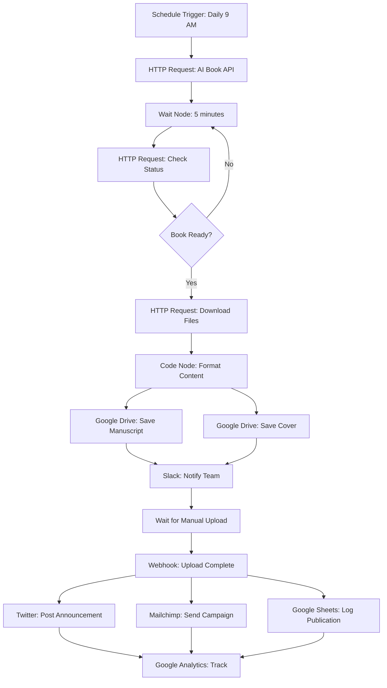

# Professional KDP Publishing with n8n Automation
## Complete Guide for Beginners (No Writing Experience Required)

---

## Table of Contents
1. [What is KDP?](#what-is-kdp)
2. [Critical 2026 Policy Changes](#critical-2026-policy-changes)
3. [Publishing Without Writing Experience](#publishing-without-writing-experience)
4. [Complete KDP Publishing Process](#complete-kdp-publishing-process)
5. [n8n Automation for KDP](#n8n-automation-for-kdp)
6. [Professional Success Strategies](#professional-success-strategies)
7. [Income Expectations](#income-expectations)
8. [Recommended Workflow](#recommended-workflow)
9. [Tools & Resources](#tools-and-resources)
10. [Compliance Notes](#compliance-notes)
11. [Sources](#sources)

---

## What is KDP?

**Kindle Direct Publishing (KDP)** is Amazon's self-publishing platform that allows you to publish eBooks (Kindle), paperbacks, and hardcovers directly to millions of readers worldwide. Your books typically go live within **12 hours** for English-language content.

### Key Benefits:
- Free to publish (no upfront costs)
- Access to Amazon's massive customer base
- 35% or 70% royalty options
- Global distribution
- Print-on-demand (no inventory needed)
- Complete creative control

---

## Critical 2026 Policy Changes

Amazon has introduced major rule changes that every KDP publisher must know:

### 🚨 AI Disclosure Requirements

| Type | Definition | Disclosure Required? |
|------|------------|---------------------|
| **AI-Generated** | Content created by AI tools (text, images, translations) | ✅ YES - MANDATORY |
| **AI-Assisted** | Human-written, then edited with tools (Grammarly, ProWritingAid) | ❌ NO |

**Penalties for Non-Disclosure:**
- Book removal from Amazon
- Account warnings
- Potential account suspension

### 📚 Publishing Limits
- **Maximum 3 books per day** per account
- Implemented to combat AI spam and low-quality content
- Frequent uploads may trigger originality verification

### 📖 New Format Options (Starting January 20, 2026)
- EPUB format now allowed
- PDF format now allowed
- DRM-free options available

### 🎯 Quality Focus
Amazon is prioritizing:
- Content quality over volume
- Transparency in content creation
- Reader value and satisfaction
- Authentic storytelling

---

## Publishing Without Writing Experience

You have three main options to create KDP books without traditional writing skills:

### Option 1: AI-Powered Book Generation ⚡

Modern AI tools can create complete books in minutes:

| Tool | Capabilities | Time Required | Key Features |
|------|-------------|---------------|--------------|
| **Royalty Profits AI** | Complete book creation (writing, formatting, cover, description, author details) | 6 minutes | All-in-one platform, ready-to-publish output |
| **Ohanashi AI Gen** | Illustrated storybooks with consistent artwork | Under 1 hour | 20-30 pages, professional covers, KDP-ready exports |
| **KDP Wizard** | Outline to full manuscript generation | Minutes | Automated research and structure |
| **Publishing.ai** | Topic generation, customer research, outline, full book | Automated | Market research included |

**⚠️ Critical Reminder:** You MUST disclose AI-generated content when publishing to Amazon KDP.

### Option 2: Professional Ghostwriters 👥

Hire experienced writers to create custom content:

**Dedicated KDP Services:**
- **KDP Partner** - Full ghostwriting and publishing services
- **KDP PROFS** - Professional writing, editing, and formatting

**Freelance Platforms:**
- Upwork
- Fiverr
- Reedsy
- Specialized KDP ghostwriter communities

**Typical Costs:**
- Short books (5,000-10,000 words): $100-$500
- Medium books (20,000-30,000 words): $500-$2,000
- Full-length books (50,000+ words): $2,000-$10,000+

### Option 3: PLR (Private Label Rights) Content 📄

Purchase pre-written content that you can rebrand and publish:

**What is PLR?**
- Pre-written books, articles, or content
- You purchase the rights to modify and republish
- Can rebrand as your own work
- Often sold in bundles or packages

**PLR Strategies:**
- Modify and improve existing PLR books
- Combine multiple PLR sources
- Use as foundation, add original content
- Convert into multiple formats (audiobooks, workbooks)

**Where to Find PLR:**
- PLR.me
- IDPLR
- Master Resell Rights websites
- Specialized KDP PLR sellers

---

## Complete KDP Publishing Process

### Step 1: Account Setup 🔧

1. **Create Your Account**
   - Visit [kdp.amazon.com](https://kdp.amazon.com/en_US/)
   - Log in with existing Amazon account or create new one
   - Access the KDP dashboard

2. **Complete Tax Information**
   - U.S. citizens: W-9 form
   - Non-U.S. citizens: W-8BEN form
   - Required for royalty payments

3. **Set Up Payment Method**
   - Direct deposit (preferred)
   - Wire transfer
   - Check (limited regions)
   - Minimum payment threshold: $10

### Step 2: Book Details 📝

Navigate to the **Details** section in KDP:

**Required Information:**
- **Book Title:** Main title of your book
- **Subtitle:** Additional descriptive text (optional but recommended)
- **Author Name:** Can be your real name or pen name
- **Description:** Sales copy (up to 4,000 characters)
  - Use HTML formatting for better presentation
  - Include bullet points and key benefits
  - End with a call-to-action

**Discoverability Settings:**
- **Keywords:** 7 keyword phrases (critical for search)
  - Use tools like Publisher Rocket for research
  - Focus on buyer keywords, not general terms
- **Categories:** Choose 2 categories
  - Research best-selling categories in your niche
  - Contact KDP support to add up to 10 total categories
- **Age Range:** For children's books
- **Grade Range:** For educational books

**AI Disclosure:**
- Indicate if content is AI-generated
- Select appropriate checkbox during upload

### Step 3: Content Upload 📤

Navigate to the **Content** section:

**Manuscript Upload:**
- Accepted formats: DOCX, PDF, MOBI, EPUB (starting Jan 2026)
- Use KDP's formatting guidelines
- Test on multiple devices using preview tool

**Book Cover:**
- Option 1: Upload your own cover (JPEG, PNG)
  - Minimum 1,000 pixels on shortest side
  - Recommended: 2,560 x 1,600 pixels
- Option 2: Use KDP Cover Creator (free tool)
- Option 3: Hire professional designer

**Preview Your Book:**
- Use online previewer
- Check formatting on different devices
- Verify table of contents links
- Ensure images display correctly

**Additional Settings:**
- Enable/disable Page Flip
- Digital Rights Management (DRM) settings
- ISBN assignment (KDP provides free ISBN)

### Step 4: Rights & Pricing 💰

Navigate to the **Pricing** section:

**Publishing Rights:**
- Own worldwide rights
- Own rights for specific territories
- Public domain work

**Royalty Options:**

| Royalty Rate | Price Range | Requirements | Best For |
|--------------|-------------|--------------|----------|
| **70%** | $2.99 - $9.99 | Must be enrolled in 70% territories, file size fees apply | Most fiction and non-fiction |
| **35%** | $0.99 - $200 | No restrictions | Books priced outside 70% range |

**Pricing Strategy:**
- Research competitor pricing
- Consider perceived value
- Test different price points
- Factor in royalty calculations

**KDP Select (Optional):**
- **Pros:**
  - Access to Kindle Unlimited (KU) borrows
  - Countdown Deals and Free Book Promotions
  - 70% royalty in additional countries
  - Pages Read compensation
- **Cons:**
  - 90-day exclusivity (can't publish ebook elsewhere)
  - Must re-enroll or opt-out before auto-renewal

### Step 5: Publish 🚀

**Final Steps:**
1. Review all information carefully
2. Check preview one more time
3. Click "Publish Your Kindle eBook"
4. Wait for Amazon's review process

**Timeline:**
- English books: 12-24 hours typically
- Non-English books: Up to 72 hours
- Quality review conducted by Amazon
- Email notification when live

**After Publishing:**
- Book appears on Amazon
- Available for purchase globally
- You can make changes anytime (updates take 12-72 hours)

---

## n8n Automation for KDP

### Important Limitation ⚠️

**Amazon KDP does NOT provide an official public API.**

Multiple sources confirm:
- No public REST API for KDP operations
- No official developer documentation
- Community requests for API access have been denied

This means direct automation of book uploads is not possible through standard API calls.

### What n8n CAN Automate ✅

Despite no direct KDP API, n8n can automate significant parts of your publishing workflow:

#### 1. Content Creation Workflow 📝

```
Manual Trigger / Schedule
         ↓
AI Content Generation (OpenAI/Claude API)
         ↓
Quality Check & Processing
         ↓
Format Conversion
         ↓
File Storage (Google Drive/Dropbox)
         ↓
Notification (Email/Slack)
```

**n8n Nodes to Use:**
- OpenAI node (GPT-4 for content generation)
- HTTP Request node (for AI book generation tools)
- Code node (for text processing)
- Google Drive / Dropbox nodes
- Email / Slack notification nodes

**Example Workflow:**
1. Schedule trigger runs daily
2. Calls AI API with book parameters
3. Receives generated manuscript
4. Formats to DOCX
5. Saves to Google Drive folder
6. Sends Slack notification with download link

#### 2. Research & Topic Discovery 🔍

```
Keyword Input
      ↓
Google Trends Analysis
      ↓
Amazon Best Seller Research
      ↓
Competitor Analysis
      ↓
Topic Selection Algorithm
      ↓
Notification with Results
```

**n8n Nodes to Use:**
- HTTP Request (Google Trends API)
- HTTP Request (Amazon Product API)
- Webhook (receive research requests)
- Function node (data analysis)
- Google Sheets (store results)
- Email node (send reports)

#### 3. Post-Publishing Marketing 📣

```
Webhook (Book Published)
         ↓
Social Media Posts
    ↓    ↓    ↓
Twitter Facebook Instagram
         ↓
Email Marketing Campaign
         ↓
Update Website/Blog
         ↓
Analytics Tracking
```

**n8n Nodes to Use:**
- Twitter node
- Facebook/Instagram nodes
- Mailchimp / SendGrid nodes
- HTTP Request (WordPress API)
- Google Analytics node
- Schedule node (for drip campaigns)

#### 4. Sales & Reporting Dashboard 📊

```
Amazon Reports API
         ↓
Data Extraction & Processing
         ↓
Google Sheets / Database
         ↓
Visualization Dashboard
         ↓
Automated Alerts (sales milestones)
```

**n8n Nodes to Use:**
- HTTP Request (Amazon SP-API)
- Google Sheets node
- PostgreSQL / MySQL nodes
- Math operations node
- Conditional logic node
- Slack/Email for alerts

### What n8n CANNOT Directly Automate ❌

Due to lack of official API:
- Direct book uploads to KDP dashboard
- Automated form filling on KDP website
- Direct interaction with KDP interface
- Real-time KDP account management

### Workarounds for Upload Automation 🔄

Since there's no official KDP API, consider these alternatives:

#### Option 1: Browser Automation (Outside n8n)

**Tools:**
- [Amazon-KDP-Automater](https://github.com/BrahimAkar/Amazon-KDP-Automater) - Open source GitHub project
- [KDP Uploader Chrome Extension](https://chromewebstore.google.com/) - Browser extension
- Selenium / Puppeteer - Custom scripts
- Playwright - Modern automation framework

**How It Works:**
- Automated browser interactions
- Fills forms automatically
- Uploads files programmatically
- Simulates human clicks and inputs

**Limitations:**
- May break with KDP UI changes
- Against Amazon's ToS (use at own risk)
- Requires maintenance
- Detection risk

#### Option 2: Hybrid Workflow (Recommended)

Combine n8n automation with manual uploads:

```
┌─────────────────────────────────────┐
│   n8n WORKFLOW                      │
│   (Content Creation)                │
│                                     │
│   1. Generate book content          │
│   2. Create cover                   │
│   3. Format files                   │
│   4. Organize in folder             │
│   5. Send "Ready to Upload" alert   │
└─────────────────────────────────────┘
              ↓
┌─────────────────────────────────────┐
│   MANUAL STEP                       │
│   (10-15 minutes)                   │
│                                     │
│   1. Log into KDP                   │
│   2. Fill book details              │
│   3. Upload files                   │
│   4. Set pricing                    │
│   5. Publish                        │
└─────────────────────────────────────┘
              ↓
┌─────────────────────────────────────┐
│   n8n WORKFLOW                      │
│   (Marketing)                       │
│                                     │
│   1. Trigger via webhook            │
│   2. Post to social media           │
│   3. Email subscribers              │
│   4. Track analytics                │
└─────────────────────────────────────┘
```

#### Option 3: Third-Party Automation Services

Some paid services claim to offer KDP automation:
- **Flying Upload** - KDP upload automation tool
- Custom browser automation services
- Virtual assistants (VAs) for manual uploading

### Sample n8n Workflow Architecture 🏗️

#### Complete KDP Publishing Workflow



### Detailed n8n Node Configurations

#### Example 1: AI Book Generation Workflow

**Node 1: Manual Trigger**
```json
{
  "name": "Manual Trigger",
  "type": "n8n-nodes-base.manualTrigger"
}
```

**Node 2: HTTP Request - Generate Book**
```json
{
  "name": "Generate Book",
  "type": "n8n-nodes-base.httpRequest",
  "method": "POST",
  "url": "https://api.ai-book-tool.com/generate",
  "authentication": "headerAuth",
  "sendBody": true,
  "bodyParameters": {
    "topic": "{{ $json.topic }}",
    "genre": "{{ $json.genre }}",
    "word_count": 10000,
    "tone": "professional"
  }
}
```

**Node 3: Wait Node**
```json
{
  "name": "Wait 5 Minutes",
  "type": "n8n-nodes-base.wait",
  "resume": "after",
  "amount": 5,
  "unit": "minutes"
}
```

**Node 4: Google Drive - Save File**
```json
{
  "name": "Save to Drive",
  "type": "n8n-nodes-base.googleDrive",
  "operation": "upload",
  "folderId": "YOUR_FOLDER_ID",
  "fileName": "{{ $json.book_title }}.docx"
}
```

**Node 5: Slack Notification**
```json
{
  "name": "Notify Team",
  "type": "n8n-nodes-base.slack",
  "channel": "#kdp-publishing",
  "text": "New book ready: {{ $json.book_title }}\nDownload: {{ $json.drive_link }}"
}
```

#### Example 2: Marketing Automation Workflow

**Webhook Trigger**
```json
{
  "name": "Book Published Webhook",
  "type": "n8n-nodes-base.webhook",
  "path": "book-published",
  "method": "POST"
}
```

**Twitter Post**
```json
{
  "name": "Post to Twitter",
  "type": "n8n-nodes-base.twitter",
  "text": "Just published: {{ $json.book_title }}!\n\nCheck it out: {{ $json.amazon_link }}\n\n#KDP #NewBook #IndieAuthor"
}
```

**Email Campaign**
```json
{
  "name": "Send Email Campaign",
  "type": "n8n-nodes-base.mailchimp",
  "operation": "create",
  "campaignType": "regular",
  "subject": "New Book: {{ $json.book_title }}",
  "fromEmail": "author@example.com"
}
```

### n8n Pricing for KDP Workflows

**Key Advantage:** n8n charges per workflow execution, not per operation.

Unlike Zapier (charges per task), n8n allows unlimited operations within a single workflow execution.

**Pricing Options:**
- **Self-Hosted:** Free (requires server)
- **Cloud Starter:** ~$20/month (5,000 executions)
- **Cloud Pro:** ~$50/month (10,000 executions)

For KDP publishing, a single workflow execution might include:
- 50+ operations (API calls, data transformations)
- Multiple file operations
- Several notification sends
- All count as ONE execution

---

## Professional Success Strategies

### 1. Treat It Like a Business 💼

**Key Principles:**
- Consistency over one-time efforts
- Data-driven decision making
- Continuous learning and adaptation
- Professional presentation

**Business Fundamentals:**
- Track expenses and income
- Set monthly publishing goals
- Invest in quality (covers, editing)
- Build systems and processes
- Treat readers as customers

### 2. Build a Catalog Strategy 📚

**Why Catalog Matters:**
- Single books rarely generate significant income (<$50/month average)
- Each new book boosts backlist sales
- Creates compound earnings effect
- Builds author platform and credibility

**Catalog Building Approach:**
- **Months 1-3:** Publish 1-2 books/week (8-24 books total)
- **Months 4-6:** Focus on marketing existing books, add 1 book/week
- **Months 7-12:** Optimize catalog, add strategic new releases
- **Year 2+:** Maintain and expand successful niches

**Series Strategy:**
- Book 1 attracts readers (often priced lower)
- Books 2-5+ generate main income
- Readers binge series (multiple purchases)
- Easier marketing (existing audience)

### 3. Quality Over Quantity 🌟

**Essential Quality Standards:**

**Content Quality:**
- Professional editing (even for AI content)
- Grammar and spelling checks
- Logical structure and flow
- Value-driven content
- Reader-focused approach

**Cover Design:**
- Professional-looking covers (DIY or hire designer)
- Genre-appropriate design
- Readable thumbnail (critical!)
- Consistent series branding

**Book Description:**
- Compelling hook in first sentence
- Clear benefits for reader
- Professional formatting
- Keywords naturally integrated
- Strong call-to-action

**Reader Experience:**
- Proper formatting
- Working table of contents
- Correct page numbering
- No layout issues
- Mobile-friendly

### 4. Research-Driven Niche Selection 🎯

**Market Research Process:**

**Step 1: Keyword Research**
- Use Publisher Rocket, KDP Spy, or AMZ Suggestion Expander
- Find keywords with:
  - High search volume (1,000+ searches/month)
  - Low competition (few results)
  - Buying intent ("how to", "guide", "workbook")

**Step 2: Competitor Analysis**
- Analyze top 10 books in target category
- Check:
  - Number of reviews (ideally 50-200 - not too competitive)
  - Best Seller Rank (BSR under 100,000 = good sales)
  - Price points
  - Cover quality
  - Page count
  - Publication dates

**Step 3: Profitability Assessment**
- Calculate potential monthly income:
  - BSR to sales calculator tools
  - Price point × royalty rate
  - Multiply by estimated daily sales
- Consider production costs
- Aim for 500%+ ROI minimum

**Profitable Niche Characteristics:**
- Specific problem-solving topics
- Passion-based interests (hobbies, crafts)
- Professional development
- Self-improvement
- Low-content opportunities (journals, planners)

### 5. Strategic Pricing 💵

**Pricing Psychology:**

| Price Point | Perceived Value | Best For | Typical Royalty |
|-------------|-----------------|----------|-----------------|
| $0.99 | Entry-level, impulse buy | Series starters, promotions | 35% ($0.35) |
| $2.99 | Value conscious | Fiction, short reads | 70% ($2.09) |
| $4.99 | Quality standard | Most books | 70% ($3.49) |
| $6.99 | Premium | Comprehensive guides | 70% ($4.89) |
| $9.99 | Expert/Professional | Specialized knowledge | 70% ($6.99) |
| $10+ | Premium/Reference | Technical, academic | 35% (varies) |

**Pricing Strategies:**
- **Launch Price:** Start at $0.99-$2.99 to get reviews, increase later
- **Series Pricing:** Book 1 low ($2.99), rest higher ($4.99-$6.99)
- **Testing:** A/B test different prices monthly
- **Seasonal:** Adjust for holidays and trends

### 6. Marketing Essentials 📢

**Pre-Launch (2-4 weeks before):**
- Build email list (even small list helps)
- Create social media buzz
- Line up beta readers for early reviews
- Prepare launch materials

**Launch Week:**
- Price low for momentum ($0.99-$2.99)
- Email your list
- Social media announcements
- Engage in relevant online communities
- Consider Amazon Ads

**Post-Launch:**
- Gradually increase price
- Continue social media presence
- Email follow-ups
- Monitor reviews and respond
- Run periodic promotions

**Marketing Channels:**

**Free:**
- Social media (Twitter, Facebook, Instagram)
- Author website/blog
- Guest posting
- Podcast interviews
- YouTube (book trailers, author talks)
- GoodReads
- Free promotions via KDP Select

**Paid:**
- Amazon Marketing Services (AMS)
  - Sponsored Products
  - Sponsored Brands
  - Lockscreen Ads
- BookBub Featured Deals (premium but effective)
- Facebook Ads
- BookBub Ads
- Free + shipping funnel

### 7. Expand and Diversify 🌍

**Format Expansion:**
- Start with Kindle eBook
- Add paperback (minimal extra work)
- Consider hardcover for premium titles
- Create audiobook (ACX, Findaway Voices)
- Bundle formats

**Language Translation:**
- Use professional translators
- Start with major languages (Spanish, French, German)
- Test with one book before scaling
- Tap into international markets

**Rights Management:**
- Audiobook rights (ACX exclusive vs. non-exclusive)
- Translation rights
- Large print editions
- Bulk/institutional sales

**Cross-Promotion:**
- Link books in back matter
- Create reader magnets (free book for email signup)
- Build email sequences
- Create companion products (courses, coaching)

---

## Income Expectations

### Realistic Monthly Income by Phase

#### Starter Phase ($50-$300/month)
**Characteristics:**
- 1-5 books published
- Learning basics
- Building initial audience
- Testing niches

**Timeline:** Months 1-3

**Action Items:**
- Publish consistently
- Learn from each release
- Build foundation
- Focus on quality

#### Scaler Phase ($300-$2,000/month)
**Characteristics:**
- 10-30 books in catalog
- Identified profitable niches
- Some marketing automation
- Growing email list

**Timeline:** Months 4-12

**Action Items:**
- Scale winning niches
- Improve marketing
- Build series
- Optimize pricing

#### Professional Phase ($2,000-$10,000+/month)
**Characteristics:**
- 30-100+ books
- Multiple successful series
- Established brand
- Advanced marketing systems
- Team support (VAs, designers)

**Timeline:** Year 2+

**Action Items:**
- Manage catalog strategically
- Expand to new formats
- Consider traditional publishing hybrid
- Build additional income streams

### Income Variables

**Factors Affecting Earnings:**
- Niche selection (some 10x more profitable)
- Book quality and covers
- Marketing effectiveness
- Catalog size
- Pricing strategy
- Review count and ratings
- Amazon algorithm favor
- Seasonality and trends

### Real Income Examples

**Conservative Scenario:**
- 20 books @ $50/month each = $1,000/month
- 10 books × 6 months = 60 hours work
- $1,000/60 hours = $16.67/hour effective rate

**Moderate Scenario:**
- 30 books @ $150/month each = $4,500/month
- With optimized systems and quality

**Optimistic Scenario:**
- 50 books @ $200/month each = $10,000/month
- 2-3 bestsellers @ $1,000+/month each
- Total: $13,000+/month

**Reality Check:**
- Most publishers: $0-$500/month
- Dedicated publishers: $500-$2,000/month
- Top 10%: $2,000-$10,000/month
- Top 1%: $10,000+/month

---

## Recommended Workflow for Beginners

### Phase 1: Foundation Setup (Week 1-2) 🏗️

**Week 1: Account & Research**

**Day 1-2: KDP Account Setup**
- Create KDP account at [kdp.amazon.com](https://kdp.amazon.com)
- Complete profile information
- Submit tax forms (W-9 or W-8BEN)
- Set up payment method
- Familiarize yourself with dashboard

**Day 3-4: Niche Research**
- Install Publisher Rocket or similar tool
- Research 10+ potential niches
- Analyze competition levels
- Check bestseller ranks
- Calculate potential profitability

**Day 5-7: Content Planning**
- Select your first niche
- Outline book structure
- Decide on content creation method (AI/ghostwriter/PLR)
- Purchase tools or services needed

**Week 2: First Book Creation**

**Day 8-10: Content Creation**
- Generate book content via AI tool OR
- Brief ghostwriter with requirements OR
- Purchase and modify PLR content
- Aim for 10,000-20,000 words minimum

**Day 11-12: Editing & Formatting**
- Edit content for quality
- Use Grammarly/ProWritingAid
- Format for Kindle (use KDP templates)
- Create table of contents
- Add front/back matter

**Day 13-14: Cover & Description**
- Design cover (Canva or hire on Fiverr: $5-$50)
- Write compelling book description
- Research and select 7 keywords
- Choose 2 categories
- Prepare all metadata

### Phase 2: First Publication (Week 3) 📤

**Day 15-16: Upload to KDP**
- Log into KDP dashboard
- Click "Create New Title"
- Fill in book details section
- Upload manuscript and cover
- Complete pricing and rights
- Disclose AI usage if applicable

**Day 17-18: Pre-Launch Preparation**
- Preview book on all devices
- Publish and wait for approval (12-72 hours)
- Prepare social media posts
- Set up author central page
- Create email announcement

**Day 19-21: Launch Week**
- Book goes live
- Share on social media
- Email friends/family
- Post in relevant communities
- Monitor for issues
- Start work on book #2

### Phase 3: n8n Automation Setup (Week 4) 🤖

**Day 22-23: n8n Installation**
- Choose hosting option:
  - Self-hosted (Docker) OR
  - n8n Cloud trial
- Complete initial setup
- Familiarize with interface
- Review documentation

**Day 24-25: Content Workflow Automation**
- Create first workflow: AI content generation
- Connect OpenAI or similar API
- Set up file storage (Google Drive)
- Configure notification system
- Test workflow end-to-end

**Day 26-27: Marketing Workflow Automation**
- Create social media automation
- Set up Twitter/Facebook posting
- Configure email marketing integration
- Create webhook for book launches
- Test complete marketing flow

**Day 28: Optimization**
- Review week 3 sales data
- Adjust pricing if needed
- Plan next 3 books
- Optimize n8n workflows
- Set publishing schedule

### Phase 4: Scale & Optimize (Month 2-3) 📈

**Week 5-8: Consistent Publishing**

**Publishing Schedule:**
- Weeks 5-8: Publish 1-2 books per week
- Total: 4-8 new books
- Focus on same niche for momentum
- Build series if possible

**Weekly Routine:**
- Monday: Research & plan new book
- Tuesday-Wednesday: Content creation
- Thursday: Editing & formatting
- Friday: Cover & metadata preparation
- Weekend: Upload & launch

**Continuous Improvement:**
- Track which books sell best
- Analyze successful patterns
- Improve covers based on feedback
- Refine descriptions
- Adjust pricing strategies
- Build email list

**Marketing Activities:**
- Post daily on social media
- Engage in author communities
- Collect and respond to reviews
- Run first Amazon Ads campaign (small budget)
- Test promotional tactics

### Phase 5: Professional Systems (Month 4+) 🚀

**Systematization:**
- Document your process
- Create templates (descriptions, formatting)
- Hire VAs for repetitive tasks
- Build content pipeline
- Automate everything possible with n8n

**Advanced Strategies:**
- Launch series strategically
- Cross-promote within catalog
- Build email funnel
- Create bonus content
- Expand to other formats (audiobooks)

**Financial Management:**
- Track all expenses
- Calculate ROI per book
- Reinvest profits strategically
- Set aside taxes (20-30%)
- Build emergency fund

---

## Tools and Resources

### Content Creation Tools 📝

**AI Writing Tools:**
- **ChatGPT** (OpenAI) - $20/month for GPT-4
- **Claude** (Anthropic) - Paid API access
- **Jasper AI** - $49+/month, specialized for long-form
- **Rytr** - $9-29/month, budget-friendly
- **Copy.ai** - $49+/month

**AI Book Generation Platforms:**
- **Royalty Profits AI** - One-time or subscription
- **Ohanashi AI Gen** - Storybook creation
- **KDP Wizard** - Book outlining and writing
- **Sudowrite** - Fiction writing assistance

**Editing Tools:**
- **Grammarly** - Free (basic) or Premium $12/month
- **ProWritingAid** - $20/month or $100/year
- **Hemingway Editor** - Free web version or $19.99 desktop
- **AutoCrit** - For fiction editing

**Formatting Tools:**
- **Vellum** - $249.99 (Mac only, one-time)
- **Atticus** - $147/year, all platforms
- **Kindle Create** - Free (Amazon tool)
- **Scrivener** - $49, excellent for organizing

### Design Tools 🎨

**Cover Design:**
- **Canva** - Free (limited) or Pro $12.99/month
- **Adobe Express** - Free (limited) or $9.99/month
- **BookBrush** - $9.99/month (mockups + covers)
- **DIY Book Covers** - $37 (one-time, templates)

**Hiring Designers:**
- **Fiverr** - $5-$100 per cover
- **99designs** - $299+ contest-based
- **Reedsy** - Vetted professionals, higher cost
- **Upwork** - Freelance marketplace

**Stock Images:**
- **Unsplash** - Free, high-quality
- **Pexels** - Free stock photos
- **Adobe Stock** - Paid, professional
- **Shutterstock** - Subscription-based

### Workflow Automation 🤖

**Primary Tools:**
- **n8n** - Self-hosted free or Cloud $20+/month
  - Best for technical users
  - Unlimited operations per workflow
  - Open source

**Alternatives:**
- **Zapier** - $19.99+/month
  - User-friendly
  - Charges per task
  - Large app ecosystem

- **Make** (formerly Integromat) - $9+/month
  - Visual workflow builder
  - Good pricing model
  - Strong API support

- **Pipedream** - Free tier available
  - Developer-focused
  - Code + no-code hybrid

### Research & Analytics Tools 📊

**Keyword Research:**
- **Publisher Rocket** - $97 one-time (highly recommended)
- **KDP Spy** - $47/month
- **AMZ Suggestion Expander** - Free Chrome extension
- **Google Keyword Planner** - Free

**Market Analysis:**
- **K-lytics** - $47-$97/month (niche reports)
- **TCK Publishing** - Free resources
- **Kindlepreneur** - Blog + tools

**Sales Tracking:**
- **BookReport** - Free for 5 books
- **NovelRank** - Free sales tracking
- **KDP Reports** - Built into KDP dashboard

### Marketing Tools 📢

**Email Marketing:**
- **Mailchimp** - Free up to 500 subscribers
- **ConvertKit** - $9+/month, author-focused
- **MailerLite** - Free up to 1,000 subscribers
- **BookFunnel** - $20+/month (for reader magnets)

**Social Media Management:**
- **Buffer** - $5+/month
- **Hootsuite** - $49+/month
- **Later** - Free tier, $18+/month paid
- **TweetDeck** - Free (Twitter only)

**Book Promotion:**
- **BookBub** - Pay per promotion ($100-$1,000+)
- **BookBub Ads** - CPC advertising
- **Amazon Marketing Services (AMS)** - Built into KDP
- **Facebook Ads** - Self-serve advertising

**Review Generation:**
- **BookSirens** - Free + paid ARC distribution
- **NetGalley** - $450+/year (traditional)
- **StoryOrigin** - Free tier available

### Learning Resources 📚

**Courses:**
- **Publishing.com** - Comprehensive KDP training
- **Self Publishing School** - Courses + community
- **Kindlepreneur** - Free blog + paid courses
- **Income School** - Project 24 (includes publishing)

**YouTube Channels:**
- Sean Dollwet - KDP strategies
- Cassidy Cash - Low content books
- Self Publishing with Dale - Step-by-step tutorials
- Mikkelsen Twins - Publishing business

**Communities:**
- KDP Community (official forums)
- Reddit: r/selfpublishing, r/KindlePublishing
- Facebook: Multiple KDP groups
- 20BooksTo50K - Author community

**Podcasts:**
- The Self Publishing Show
- The Creative Penn Podcast
- Sell More Books Show
- The Authorpreneur Podcast

---

## Compliance Notes

### Critical Rules to Follow ⚠️

#### 1. AI Content Disclosure
**MANDATORY REQUIREMENTS:**
- ✅ Check "Yes" if content is AI-generated
- ✅ Disclose in book description (optional but recommended)
- ✅ Keep records of your content creation process

**PENALTIES FOR NON-DISCLOSURE:**
- Book removal from Amazon
- Account warnings
- Potential account suspension
- Loss of royalties

**What Counts as AI-Generated:**
- Text written by AI (ChatGPT, Claude, etc.)
- Images created by AI (Midjourney, DALL-E)
- Translations done by AI
- Content that's edited but primarily AI-written

**What Does NOT Require Disclosure:**
- Content edited by Grammarly, ProWritingAid
- Human-written content with minor AI assistance
- Content checked for grammar/spelling by AI

#### 2. Publishing Limits
**CURRENT LIMITS:**
- ✅ Maximum 3 books per 24 hours
- ✅ Applies per account, not per marketplace
- ✅ Includes new titles and new editions

**CONSEQUENCES OF VIOLATION:**
- Content suppression
- Account review
- Potential account suspension
- Required originality verification

**BEST PRACTICES:**
- Publish 1-2 books per day maximum
- Space out publications
- Focus on quality over quantity
- Build systematic publishing schedule

#### 3. Copyright & Originality
**MUST FOLLOW:**
- ✅ Own rights to all content
- ✅ Don't plagiarize or copy existing books
- ✅ Verify PLR content has proper rights
- ✅ Create unique content, not duplicates

**COPYRIGHT ISSUES:**
- Don't copy/paste from other books
- Don't republish public domain without adding value
- Don't use copyrighted images without license
- Don't infringe on trademarks

**AI-GENERATED COPYRIGHT:**
- AI content may have limited copyright protection
- Add substantial human edits and creativity
- Transform AI output significantly
- Maintain proof of originality

#### 4. Content Quality Standards
**PROHIBITED CONTENT:**
- ❌ Pornographic or offensive material
- ❌ Illegal content
- ❌ Hateful or discriminatory content
- ❌ Poor quality/gibberish content
- ❌ Misleading marketing
- ❌ Public domain republishing without value-add

**QUALITY REQUIREMENTS:**
- ✅ Properly formatted
- ✅ Readable and coherent
- ✅ Provides value to readers
- ✅ Accurate book description
- ✅ Appropriate cover image

#### 5. Metadata Integrity
**MUST BE ACCURATE:**
- ✅ Book title matches content
- ✅ Author name consistent
- ✅ Description accurately represents book
- ✅ Keywords relevant to content
- ✅ Categories appropriate

**PROHIBITED PRACTICES:**
- ❌ Keyword stuffing in title
- ❌ Misleading descriptions
- ❌ Fake reviews or review manipulation
- ❌ Inappropriate categories
- ❌ Trademark infringement in metadata

#### 6. Account Integrity
**ACCOUNT REQUIREMENTS:**
- ✅ One account per person/entity
- ✅ Accurate tax information
- ✅ Valid payment details
- ✅ Truthful account information

**PROHIBITED:**
- ❌ Multiple accounts without permission
- ❌ Account sharing
- ❌ False identity information
- ❌ Ban evasion

#### 7. Review Policies
**ALLOWED:**
- ✅ Ask readers for honest reviews
- ✅ Use ARC (Advance Review Copy) services
- ✅ Provide free copies for reviews

**PROHIBITED:**
- ❌ Pay for positive reviews
- ❌ Compensated reviews without disclosure
- ❌ Fake or misleading reviews
- ❌ Review manipulation
- ❌ Review swapping schemes

#### 8. Image and Cover Requirements
**MUST FOLLOW:**
- ✅ Own rights to cover images
- ✅ Appropriate cover for content
- ✅ Meets technical specifications
- ✅ No misleading imagery

**TECHNICAL SPECS:**
- Minimum: 1,000 pixels shortest side
- Recommended: 2,560 x 1,600 pixels
- Ratio: 1:1.6 (height:width)
- Format: JPEG or PNG

#### 9. International Compliance
**TAX COMPLIANCE:**
- U.S. authors: W-9 form
- Non-U.S. authors: W-8BEN form
- Withholding rates vary by country
- Tax treaties may reduce withholding

**GDPR (European readers):**
- If collecting reader emails
- Privacy policy required
- Data protection compliance
- Right to deletion

#### 10. KDP Select Rules
**IF ENROLLED IN KDP SELECT:**
- ✅ Digital exclusivity required (90 days)
- ✅ Can't publish ebook elsewhere
- ✅ Print and audio rights unaffected

**CONSEQUENCES OF VIOLATION:**
- Loss of KDP Select benefits
- Potential account suspension
- Forfeiture of KU page reads
- Payment withholding

### Staying Compliant Checklist ✅

**Before Publishing Every Book:**
- [ ] Content is original or properly licensed
- [ ] AI disclosure completed if applicable
- [ ] No copyright infringement
- [ ] Cover image rights secured
- [ ] Metadata is accurate and truthful
- [ ] Book provides genuine value
- [ ] Formatting is professional
- [ ] Description matches content
- [ ] Tax information current
- [ ] Not exceeding 3 books/day limit

**Monthly Compliance Review:**
- [ ] Monitor account health
- [ ] Check for policy updates
- [ ] Review KDP emails
- [ ] Verify payment information
- [ ] Audit book catalog for issues
- [ ] Update content if needed

---

## Sources

### Official Amazon KDP Resources
- [Amazon Kindle Direct Publishing](https://kdp.amazon.com/en_US/) - Official KDP platform
- [KDP Content Guidelines](https://kdp.amazon.com/en_US/help/topic/G200672390) - Official content policies
- [Create a Book - KDP Help](https://kdp.amazon.com/en_US/help/topic/G202172740) - Publishing guide
- [KDP Jumpstart](https://kdp.amazon.com/en_US/help/topic/G202187740) - Getting started guide

### 2026 Policy Changes & AI Disclosure
- [Amazon KDP Major Rule Changes for 2026](https://www.writercosmos.com/blog/amazon-kdp-announces-major-publishing-rule-changes-for-authors-in-2026/) - Policy updates
- [Amazon KDP Rules on AI Content](https://blog.youbooks.com/amazon-kdp-rules-on-ai-content/) - AI disclosure requirements
- [Amazon's AI Content Disclosure Policy](https://authorsguild.org/news/amazons-new-disclosure-policy-for-ai-generated-book-content-is-a-welcome-first-step/) - Authors Guild analysis
- [Amazon Updates KDP Guidelines for AI](https://authorpreneurpodcast.com/kdp-guidelines-ai-content/) - Policy explanation
- [Amazon Copyright Changes for KDP](https://techcrunch.com/2025/12/10/amazon-changes-how-copyright-protection-is-applied-to-kindle-directs-self-published-ebooks/) - TechCrunch coverage

### Market Analysis & Income Data
- [Is KDP Still Worth Pursuing in 2026?](https://www.brandonrohrbaugh.com/blog/is-kdp-still-worth-pursuing-in-2026) - Market analysis
- [KDP Income in 2026: What Authors Actually Make](https://neucitepress.com/kdp-income-in-2026-what-self-published-authors-actually-make/) - Income expectations
- [Is Amazon KDP Still Worth It in 2026?](https://medium.com/activated-thinker/is-amazon-kdp-still-worth-it-in-2026-247437fb9eed) - Medium analysis

### n8n Automation Resources
- [n8n Amazon Integration](https://n8n.io/integrations/amazon/) - Official integration docs
- [n8n Documentation](https://docs.n8n.io/) - Complete n8n documentation
- [Amazon and Google Books Workflow](https://n8n.io/integrations/amazon/and/google-books/) - Workflow examples
- [Amazon and Product Hunt Workflow](https://n8n.io/integrations/amazon/and/product-hunt/) - n8n integration example
- [Amazon and NPM Workflow](https://n8n.io/integrations/amazon/and/npm/) - n8n automation patterns

### Automation Tools & Projects
- [Amazon-KDP-Automater GitHub](https://github.com/BrahimAkar/Amazon-KDP-Automater) - Open source upload automation
- [KDP Uploader Chrome Extension](https://chromewebstore.google.com/detail/kdp-uploader/hfnmagmigjbbmjlanikaihcokkmidlfb) - Browser automation
- [Flying Upload - KDP Automation](https://flyingupload.com/amazon-kdp-upload-automation/) - Automation service

### AI Content Generation
- [Publishing AI-Generated Books on KDP](https://blog.bookautoai.com/publish-ai-books-amazon-kdp/) - Guidelines and strategies
- [Royalty Profits AI Review](https://hudareview.com/royalty-profits-ai-review/) - AI book creation tool
- [Royalty Profits AI Review 2025](https://makreview.com/royalty-profits-ai/) - Ultimate AI-powered KDP solution
- [Royalty Profits AI Detailed Review](https://theproductoasis.com/2025/10/royalty-profits-ai-review-kdp-sales-problem-solution-demo-pricing-oto-bonus-discount-bundle-by-demetris-papadopoulos/) - Complete analysis with demo and pricing
- [Royalty Profits AI Technical Review](https://elearning.aljazeera.net/sites/default/files/lectures/user/2025-12/royalty-profits-ai-reviews-and-otos.pdf) - PDF review and OTOs
- [OHANASHI AI GEN Review](https://jvupsell.com/2025/10/ohanashi-ai-gen-review/) - AI storybook creation tool
- [KDP Books Generator Tool](https://www.opentoolai.com/2025/05/kdp-books-generator-tool.html) - OpenToolAI generator
- [AI Generated Content - KDP Response](https://www.kdpcommunity.com/s/question/0D58V00007z97NFSAY/ai-generated-content-kdps-response?language=en_US) - Official KDP community
- [Amazon Revises KDP Guidelines](https://www.thebookseller.com/news/amazon-revises-kdp-guidelines-to-compel-disclosure-of-ai-content) - The Bookseller coverage

### Ghostwriting & PLR
- [Kindle Ghostwriting Guide](https://www.publishing.com/blog/kindle-ghost-writing) - Complete ghostwriting overview
- [How to Make Money on KDP Without Writing](https://www.creatorinvestor.com/influencers-money/how-to-make-money-on-amazon-kdp-without-writing) - Non-writing strategies
- [KDP Partner Ghostwriting Services](https://kdppartner.com/) - Professional services
- [KDP PROFS Services](https://kdpprofs.com/) - Professional services
- [Ghostwriter Experiences - KDP Community](https://www.kdpcommunity.com/s/question/0D5f400001e0j9rCAA/ghostwriter-experiences?language=en_US) - Community discussions

### Publishing Process Guides
- [Amazon KDP for Beginners](https://www.publishing.com/blog/amazon-kdp-for-beginners) - Comprehensive starter guide
- [Amazon KDP Guide: 7 Steps](https://selfpublishing.com/amazon-kdp/) - Step-by-step process
- [Amazon KDP Tutorial](https://www.publishing.com/blog/amazon-kdp-tutorial) - Detailed tutorial
- [How to Publish on Amazon in 6 Steps](https://blog.reedsy.com/guide/kdp/how-to-publish-a-book-on-amazon/) - Reedsy guide
- [Amazon KDP Complete Tutorial](https://medium.com/practice-in-public/how-to-publish-a-paper-book-on-amazon-kdp-complete-tutorial-for-beginners-000808e07fab) - Medium tutorial
- [KDP Step-by-Step Guide](https://www.aspiringwriteracademy.com/amazon-kdp-for-beginners-a-step-by-step-guide-to-self-publishing/) - Aspiring Writer Academy
- [Start Publishing with KDP](https://kdp.amazon.com/en_US/help/topic/GHKDSCW2KQ3K4UU4) - Official getting started guide

### API & Technical Resources
- [Is There a KDP API?](https://www.kdpcommunity.com/s/question/0D52T00004pN7JPSA0/is-there-a-kdp-api?language=en_US) - API availability discussion
- [KDP Distribution Developer's API](https://www.kdpcommunity.com/s/question/0D5f400000FHT6ZCAX/kdp-distribution-developers-api?language=en_US) - API questions
- [KDP API Community Discussion](https://kdpcommunity.com/s/question/0D58V00007VNEoISAX/api?language=en_US) - Technical API questions
- [Kindle API GitHub](https://github.com/Xetera/kindle-api) - Unofficial Kindle API for Node.js
- [Amazon KDP Topics on GitHub](https://github.com/topics/amazon-kdp) - Collection of KDP-related projects
- [KDP API Python Client](https://pypi.org/project/kdp-api-python-client/) - Koverse Data Platform API (not Amazon KDP)
- [Pipedream Amazon Integration](https://pipedream.com/apps/amazon/integrations/http) - Workflow automation with HTTP/Webhook
- [How to Automate KDP Uploads - Quora](https://www.quora.com/How-can-I-automate-my-Amazon-KDP-uploads-What-is-the-best-KDP-upload-automation-tool) - Community automation discussion

### Marketing & Strategy
- [7 Ways to Automate Amazon Publishing](https://www.publishing.com/blog/how-to-make-passive-income-on-kindle) - Automation strategies
- [Amazon KDP Publishing Guide](https://www.bebolddigital.com/blog/amazon-kdp-publishing) - Complete guide
- [Amazon Kindle Direct Publishing Overview](https://www.sellerapp.com/blog/amazon-kindle-direct-publishing/) - Platform analysis

### Additional KDP Books & Resources
- [Amazon KDP Guidebook 2026 (eBook)](https://www.amazon.com/AMAZON-KDP-GUIDEBOOK-2026-VERIFICATION-ebook/dp/B0GD6T9WPJ) - Complete KDP guide on Amazon
- [Amazon KDP Guidebook 2026 (Paperback)](https://www.amazon.com/AMAZON-KDP-GUIDEBOOK-2026-VERIFICATION/dp/B0GD8NLQ3W) - Physical book version
- [KDP Community Forums](https://www.kdpcommunity.com/) - Official Amazon KDP community discussions
- [Amazon KDP Are Asking If Content Is AI Created](https://www.kboards.com/threads/amazon-kdp-are-now-asking-if-content-and-images-are-created-by-ai-at-upload.338500/) - Kindle Boards discussion

---

## Next Steps to Get Started

### Immediate Actions (Today)

1. **Create KDP Account**
   - Go to [kdp.amazon.com](https://kdp.amazon.com)
   - Sign up or log in
   - Bookmark for easy access

2. **Research Your First Niche**
   - Browse Amazon best sellers
   - Identify 3-5 potential topics
   - Note price points and competition

3. **Decide on Content Creation Method**
   - AI tool (fastest)
   - Ghostwriter (highest quality)
   - PLR (budget-friendly)

### This Week

4. **Set Up Tools**
   - Install Grammarly (free)
   - Create Canva account (free)
   - Sign up for ChatGPT or similar AI tool

5. **Create Your First Book**
   - Generate or write 10,000+ words
   - Format properly
   - Design cover

### Next Week

6. **Complete KDP Profile**
   - Submit tax information
   - Add payment method
   - Verify account

7. **Publish First Book**
   - Upload manuscript
   - Add cover and metadata
   - Set pricing
   - Click publish

### Month 2

8. **Install n8n**
   - Choose hosting option
   - Set up basic workflow
   - Automate repetitive tasks

9. **Build Your Catalog**
   - Publish 2-4 more books
   - Test different niches
   - Learn from sales data

10. **Start Marketing**
    - Set up social media
    - Begin email list
    - Run first promotion

---

## Conclusion

Amazon KDP remains a viable platform in 2026, but success requires:

✅ **Compliance** with new AI disclosure rules
✅ **Quality** over quantity approach
✅ **Strategic** niche selection
✅ **Professional** presentation
✅ **Systematic** publishing schedule
✅ **Effective** marketing automation

While n8n cannot directly automate KDP uploads due to lack of official API, it can streamline:
- Content creation workflows
- File organization and storage
- Marketing campaign execution
- Sales tracking and reporting
- Communication automation

The key to success is treating KDP as a real business, building a catalog systematically, and providing genuine value to readers.

**Start today. Publish your first book within 2 weeks. Build your catalog over 6-12 months. Scale to consistent income.**

---

*Last Updated: January 3, 2026*
*Created with research conducted on current KDP policies, n8n capabilities, and 2026 market conditions*
